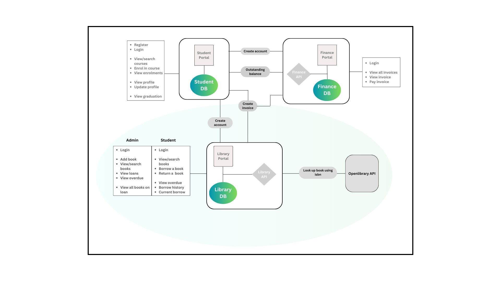

# Library Portal
A microservices-based web application for a university's library portal.
The application is written in Node.js using the express framework.

## Library portal Features - Admin
1. Login - secure password-verified login.
2. Books - return all book in database.
3. Search - search for a book using title
4. Add book - Add a new book by entering the ISBN
5. View current students loaning books - return all students who have borrowed a book and the number of books they have borrowed.
6. View overdue - return all overdue books
7. View loans - return all books currently on loan.

## Library portal Features - Student
1. Login - secure password-verified login.
2. Books - return all book in database.
3. Search - search for a book using title
4. Borrow book - borrow a book by entering the ISBN
5. View current borrowed books - return all books borrowed for logged in student.
6. View overdue - return all overdue books for logged in student
7. View borrow history - return all books previously borrowed.

### Tools - tools to be installed and setup
    1. Postgres - (https://www.postgresql.org/download/)
    2. PGADMIN - (https://www.pgadmin.org/download/) - open desktop application and create new server
            Servers -> Register -> Server.
            Under the general tab: add server name(PostgreSQL). 
            Under the connection tab: add host name(localhost), username and password. Note: These are the same details that will be used in the `config.json` file.
    3. Node version 16 - (https://nodejs.org/en/download)

### Integrations
### 1. Database
    The application integrates with a postgres database,
    Run the following commands in the terminal: to create the finance database and models:
        `npx sequelize db:create` or `sequelize db:create`
        `npx sequelize db:migrate` or `sequelize db:migrate`

### 2. Roles
### Note: create the roles and admin account, add books using admin account because the student account depends on the books added by the admin in other to be able to view/borrow books and carry out other actions.
### This application features two actors: Admin and Student.
    * Open PGADMIN, go to the library database -> schema -> tables -> roles. Create two new roles and add the following fields(role, createdAt, updatedAt). Note: make sure the admin role has an id of 1 and the student role has an id of 2.
### Admin `role_id: 1` and Student `role_id: 2`
    * Create admin account by: 
        1. Making a post request using postman: http://localhost:8082/accounts. 
            Provide the same details for creating account in the student portal:
                {"first_name": "Emma", "last_name": "Lan", "username": "emmalan", "email": "admin@example.com", "account_id": "A823456789", "role_id": 1, "password": "password"}
            Login using the email and password
        2. Create an admin account directly from PGADMIN: Make role_id: 1

### 3. Student Microservice
    * The application integrates with the [Student microservice](https://github.com/winiesom/sesc-student-portal) via REST.
    * When a student is created in the Student microservice, a request is sent to this application to create an account for the student.
    * The credentials to login are the same credentials used in the student portal (c77777777, password).

### 3. Finance Microservice
    * The application integrates with the [Finance microservice](https://github.com/winiesom/sesc-finance-portal) via REST.
    * When a book borrowed by a student from the library portal is overdue and is returned late, a request is sent to this application to generate an invoice.

## Running the application
    1. Ensure the Student and Finance portals are running.
    2. Rename the `.env.example` file in the server root directory to `.env`
    3. Edit the credential in the `.env` file and add you secret key (JWT_SECRET = 123456)
    4. In the server root, rename the `configExample` folder and `config.json.example` file as follows:
        `config` and `config.json`
    5. Edit the `config.json` file as follows: for development, test and production environments add the (username, password, database). Note: you may need to download PGADMIN desktop version.
    6. From the server directory, run the following commands in seperate terminals:
        `npm install`
        `npm start`

## Test using postman
    `https://documenter.getpostman.com/view/8758683/2s93eYTrWb`